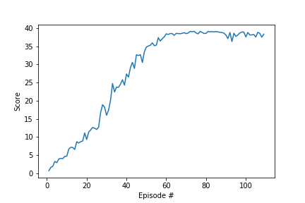

# Report: Project 2 - Continuous Controls

## Method: DDPG
In this project, the an adaption of the DDPG algorithm discussed during the course is applied. The following adjustments are pointed out:
- The DDPG algorithm has been adapted to work with 20 agents in parallel to collect experiences. This has lead to an adjusted step function: step_multi. As pointed out at the benchmark implementation of the project, the actor anc critic networks are updated after 20 timesteps, 10 times. Inputs are sampled randomly from the replay buffer which is filled from experiences of all 20 agents.
- To stabilize the code and increase learning stability, I implemented additionally:
    - Epsilon decay has been added to reduce the added noise in the act function over time. This turned out to stabilize the learning additionally over time.
    - Batch normalization layers in Neural Network
    - Gradient clipping at critic agent

### Hyper Parameters:
The following hyperparamters turned out to lead to an efficient learning:
- replay buffer size: 1e6
- minibatch size: 256
- discount factor gamma: 0.99
- tau for soft update of target parameters: 1e-3
- learning rate of the actor: 1.5e-4
- learning rate of the critic: 1e-3
- L2 weight decay: 0
- Maximum number of timesteps: 1000
- Epsilon Decay factor: 0.9999

### Neural Network Architecture
The neural network consists of two separate neural networks with the following setup:
#### Actor:
- Input: state-size (33x1)
- Fully-connected layer with RELU: 400 nodes
- Batch normalization layer 1D
- Fully-connected layer with RELU: 300 nodes
- Output layer with tanh: 4 nodes

#### Critic:
- Input: state-size (33x1)
- Fully-connected layer with RELU: 400 nodes
- Batch normalization layer 1D
- Fully-connected layer with RELU: 300 nodes
- Fully connect layer: 1 node

## Rewards Plot - The solved environment
Criterion for solving the environment: Agents must get an average score of +30 (over 100 consecutive episodes, and over all agents). As pointed out in the project instructions this means specifically:
>- After each episode, we add up the rewards that each agent received (without discounting), to get a score for each agent. This yields 20 (potentially different) scores. We then take the average of these 20 scores.
>- This yields an average score for each episode (where the average is over all 20 agents).

This environment has been resolved in: **XXX episodes**. The following plot shows the averaged rewards (20 agents) obtained during the training.

## Ideas for future work
- Alternative neural network architectures for agent and critic
- Alternative actor-critic implementations as e.g. D4PG
